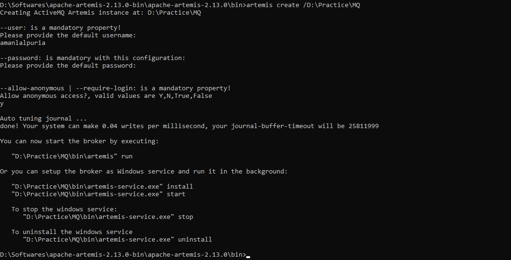
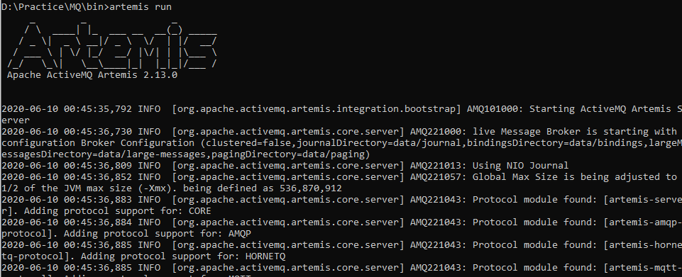

# JMS

## Setup Apache ActiveMQ

1. Download https://activemq.apache.org/components/artemis/download/
2. Unzip
3. Go to bin
4. To create broker
   
        artemis create /D:\Practice\MQ
    
    
   
   - `D:..` is the path where you want to create MQ
   - Put username and password
5. To start the Broker, go to directory where broker setup, go to the bin
   
        artemis run
    
    
6. To declare queue, open broker xml in etc folder
   ```xml
   <addresses>
        ...
        <address name="demoQueue">
        <anycast>
            <queue name="demoQueue" />
        </anycast>        
        </address>
    </addresses>
   ```
## Setup Project
1. Properties declaration in application.properties
    ```java
    spring.artemis.mode=native
    spring.artemis.host=localhost
    spring.artemis.port=61616
    spring.artemis.user=user
    spring.artemis.password=password
    jms.queue.destination=demoQueue
    ```

2. Run the project
3. Try to send simple string
   ```java
   curl --location --request GET 'http://localhost:8080/produce?msg=%22Hello%20I%20am%20Aman!%22'
   ```
4. Object as message
    ```java
    curl --location --request POST 'http://localhost:8080/produce' \
    --header 'Content-Type: application/json' \
    --data-raw '{"id":"1000", "name":"Aman"}'
    ```
